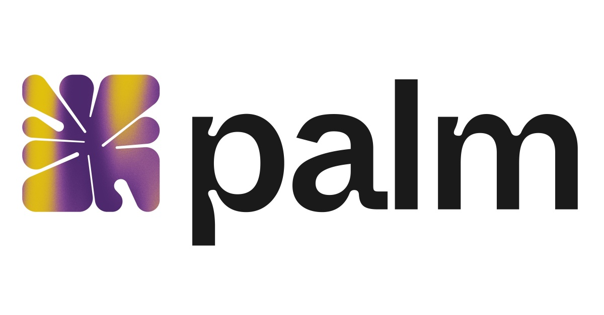
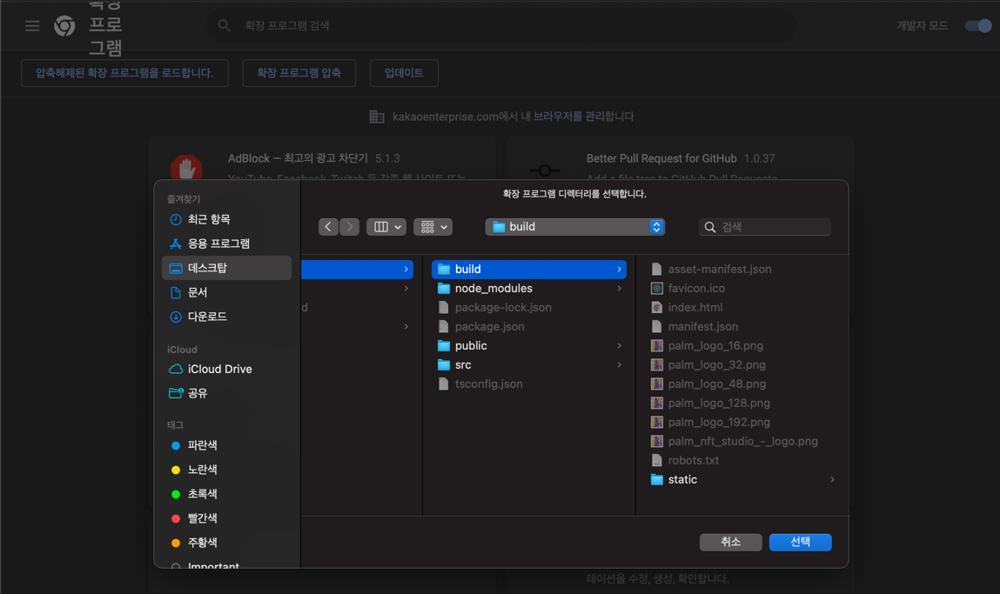
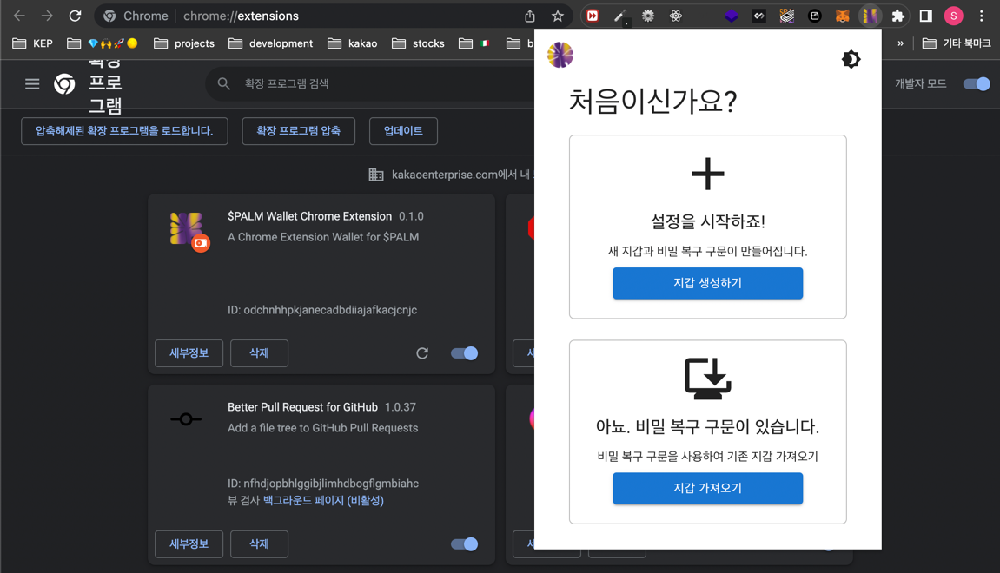

<p align="center">
    <picture>
      
    </picture>
</p>

# BTA1stProject-20

## Introduction

팜 월렛(Palm Wallet) 서비스는 니모닉 및 지갑 생성, 잔고 조회, 송금을 가능하게 하는 [Palm](https://palm.io/)에 특화된 Chrome Extension 지갑입니다.

## Getting Started

> ⚠️ 모든 명령어는 root directory를 기준으로 작성되었습니다.

### Install

```shell
# client npm 패키지 설치 및 빌드
cd client && npm install && npm run build

# api server npm 패키지 설치 및 빌드
cd server && npm install && npm run build
```

### Api server run

```shell
# api server 실행
cd server && npm run start
```

### Chrome extension 설치 및 실행

1. 위에서 빌드한 `/build` directory 추가
   
2. 크롬 익스텐션 실행
   

## References

* [Palm official website](https://palm.io/)